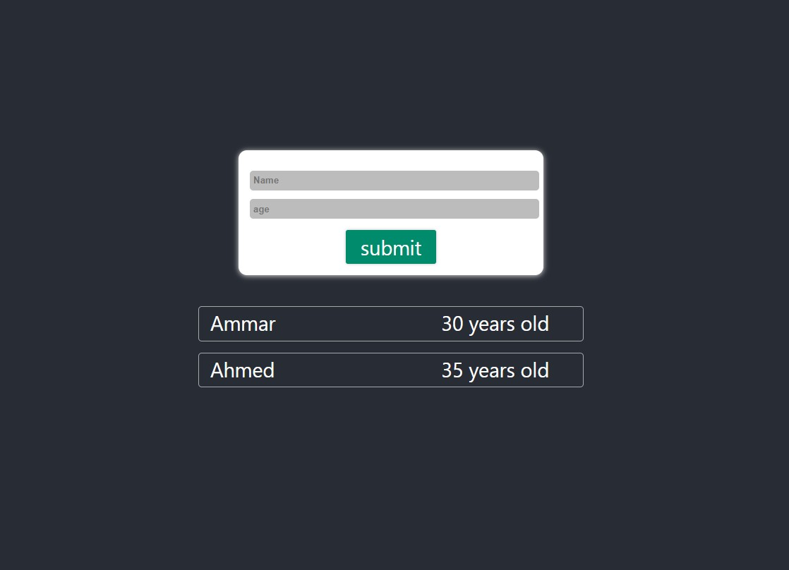

### Users Application

## App Info

This app is one of Maximilian's course apps, this is an assignment project,
It allows you to add users and render their information on the screen.

## App page

you can see this app on https://ammarnaser.github.io/users-app/

## Overview

## Available Scripts

In the project directory, you can run:

### `npm install`

run this command to install all required modules

### `npm start`

Runs the app in the development mode [http://localhost:3000](http://localhost:3000)

The page will reload when you make changes.\
You may also see any lint errors in the console.
